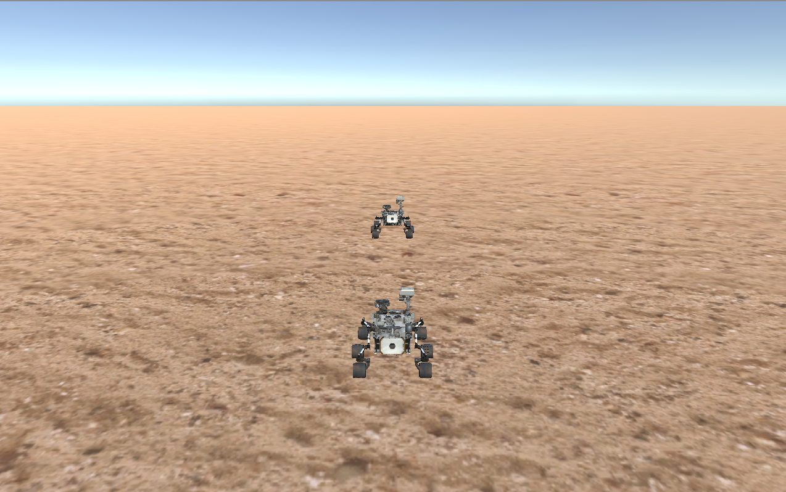

# Challenge Problem

## Introduction
We have created a simulated environment that contains two rovers called `leader` and `follower`. Upon starting the simulation, `leader` takes a random path while changing its speed continuously. The goal of the challenge problem is to use an MDD tool and design a model for `follower` such that (the code generated from) the model causes the `follower` to follow `leader` while always staying at a safe distance from it. Any tool that can generate code from models in some modeling language can be used. The generated code can be in any language, as long as it supports TCP socket communication.


To control the `follower` two set of commands are provided:

1. A set of control commands that can be used to control the `follower` such as `speedup` and `turn`.

2. A set of observation commands that allows obtaining relevant information such as the position of the the `leader`.

As illustrated in the following figure, control and observation commands are issued by sending the corresponding message using TCP connections to the `controlPort` or the `observationPort`. The numbers of these ports can be configured (see below). During execution, any situtation in which the `follower` is not within a safe distance is considered unsafe and must be avoided. The safe distance is defined as the range between the configuration parameters `maxDistance` and `minDistance` can be configured (see below).


## Starting Guide
The only prerequisite for using simulator is Java 1.8. Please make sure that Java is installed before start using the simulation.

### Download
The simulation package is avaialble for three platforms (Mac, Windows, Linux). To download please use the following links:


[Windows](https://s3.amazonaws.com/challengeproblemmichal/Challenge+problem-Windows.zip)

[Linux](https://s3.amazonaws.com/challengeproblemmichal/Challenge+problem-Linux.zip)

[Mac](https://s3.amazonaws.com/challengeproblemmichal/Challenge+problem-Mac.zip)

### Running the simulation
The simulation package is a compressed zip file which contains the following folders and files.
Note that depending on your platfrom, only one of the three folders Linux, Mac, and Windows is included.

```
.
├── Linux
│   ├── Challenge-Linux.x86             ---> Executable simulator for Linux x86
│   ├── Challenge-Linux.x86_64          ---> Executable simulator for Linux x86_64
│   └── Challenge-Linux_Data
├── Mac
│   └── Challenge-Mac.app               ---> Executable simulator for Mac
├── RoverController-Source              ---> The source code of a simple java program that controls the follower using the keyboard
│   ├── DriveCommands.java
│   ├── RoverController.java
│   └── SocketCommunicator.java
├── RoverController.jar                 ---> A simple java program that controls the follower using the keyboard
├── Settings
│   └── config.txt                      ---> Configuration file
├── UnityObserver.jar                   ---> A program that provides observation service and commands
└── Windows
    ├── Challenge-Win64.exe             ---> Executable simulator for Windows 64
    ├── Challenge-Win64_Data
    └── UnityPlayer.dll

```
To run the simulation follow the steps below:

1. Run the executable simulator. Depending on the platform used, the simulator executable is located in one of the folders `Linux|Windows|Mac`. This will load a simulation environment as shown in the following figure. As discussed, it includes two rovers `leader` and `follower`. When the simulation is loaded, the control commands are ready to use. By default, the controlPort has number 9998. However, to be able to use the observation commands, you need to start the UnityObserver.

	&nbsp; &nbsp; &nbsp;  

2. To start the observer, run the  `UnityObserver.jar`. Now, observation commands are available. By default, the observationPort has number 9999.

3. Now everything is ready to use, and you can start modeling your control. First, you need to send a `ready` command to start the simulation. To make sure that the simulation and the UnityObserver have started correctly, you can use the simple Java program (`RoverController.jar`) that allows controlling the `follower` using the arrow keys on your keyboard. The source code of this program is aviable in `RoverController-Source` and might be helpful to become more familiar with the available commands.

## Configuration
The simulation can be configured using the parameters inside the `Settings/config.txt`. You may need to change this configuration in special cases such as changing TCP ports. The main configuration and their default value are described below.

{:.mbtablestyle}
|Parameter &nbsp;            | Default Value &nbsp; | Description &nbsp; | Hints
-----------------------| --------------       |-------------
controlPort|9998|TCP port for control commands | None
observationPort |9999|TCP port for observation commands | None
leaderPort|9997|TCP port that the UnityObserver controls the leader through | Changing this configuration is not recommended
evaluationPort|9996|TCP port that the UnityObserver observes the follower through | Changing this configuration is not recommended
simulationIP|127.0.0.1|IP address that the simulation and the UnityObserver are running on | None
runTime|60000|Total execution time of the simulation in ms | None
waitMin|2000|Minimum time between direction changes for the leader in ms | None
waitMax|5000|Maximum time between direction changes for the leader in ms | None
speedMin|10|Minimum wheel motor speed for the leader in % of total | None
speedMax|60|Maximum wheel motor speed for the leader in % of total | None
straightPercent|20|Percent chance that the rover will go straight instead of turning | None
fileName|test1.csv|Name of the file to read or write movements info | None
preRecorded|false|`false` will create a new set of random moves and write them to file fileName after simulation. `true` will read moves from the file and play them back. | None
minDistance|12|Distance at which the follower is too close to the leader | None
maxDistance|15|Distance at which the follower is too far from the leader | None
sampleRate|250|Time in ms between position updates and distance evaluations | None


## Supported Commands
Several commands are provided for control and observation which can be used by sending a message to the corresponding TCP port. Each message is an ASCII string. The format of a control message is `"Rover,"+commandID([command Parameter]*)`. For example, there is a `brake` command that accepts one integer parameter, so sending the string  `"Rover,brake(2)"` will invoke the brake command with parameter 2 and result in the brake being applied to all wheels with a power of 2%. Observation messages are simpler and consist only of one of four strings (`"posx"`, `"posz"`, `"dist"`, and `"ready"`). Three of these return a string containing a real indicating the x position, the y position, or the distance of the leader rover, respectively. Below we describe the supported commands.

### Control Commands 

  
|Message Format &nbsp;           | Return Message &nbsp;       | Description   &nbsp; |
:-----------------------| :---------------------------   |:------------- |
"Rover,setForwardPower(\<Int\>)" | None | Set the power applied to all wheels as a percentage of max power (-100 to 100) |
"Rover,incrementPower(\<Int\>)"  | None         | Increment the power applied to all wheels as a percentage of max power (-100 to 100)|
"Rover,setLRPower(\<Int\>,\<Int\>)" &nbsp;     | None         | Set the power of the left and right wheels as percentages of max power (-100 to 100). First <Int> is for left side and the second for right side|
"Rover,brake(\<Int\>)"         | None         | Apply the amount of brake power to all wheels as a percentage of max brake force (0-100) |
"Rover,GPSx()"         | "Rover,\<Real\>" &nbsp;         | Returns the X coordinate as a Real value|
"Rover,GPSy()"         | "Rover,\<Real\>"        	| Returns the Y coordinate as a Real value|
"Rover,GPSz()"         | "Rover,\<Real\>"       	| Returns the Z coordinate as a Real value|
"Rover,getCompass()"         | "Rover,\<Real\>"    | Returns the degrees clockwise from North as a Real value|


### Observation Commands  

|Message Format   &nbsp;           | Return Message &nbsp;       | Description   &nbsp;                                        |
:-----------------------| :--------------   |:------------- |
"posx"        | "\<Real\>"               | Returns the x position of the `leader` as a Real value  |
"posz"       | "\<Real\>"              | Returns the z position of the `leader` as a Real value  |
"dist"         | "\<Real\>"                 | Returns the distance between `follower` and `leader` as a Real value &nbsp; |
"ready"         | None               | Indicates your program is ready, and begins the simulation |


## How to evaluate your solution?
As mentioned, the `follower` should always keep a safe distance from the `leader`. To enforce this rule, the `UnityObserver` always monitors the distance between the two rovers and reports the amount of time that the `follower` violates it, i.e., is out of the safe distance. You can evaluate your solution based on this data reported by the `UnityObserver`.

Note that by setting `straightPercent` to `0`, `leader` will take a straight path, hence following it would be an easy problem to solve. We expect your solution work with different values for `straightPercent`.
