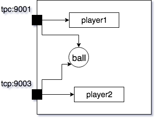

## Overview of the Challenge Problem
We have created a simulation (Ref. [SimGen](https://github.com/PasternakMichal/SimGen)) of a simplified RoboCup-type game inspired by [https://ssim.robocup.org/](https://ssim.robocup.org/) as shown in the following figure. The simulation contains a `ball` and two players  `red (player2)` and `blue (player1)` who compete against each other. By default, the `blue` player can be controlled by the keyboard or by the simulation where its movements are random. The challenge consists of creating a model to control the `red` player. The objective of each player is to shoot as many goals as possible. Note that the coordinates of the field are shown in the corners of the figure.


&nbsp; &nbsp; &nbsp; &nbsp; &nbsp; &nbsp;&nbsp; &nbsp; &nbsp; &nbsp; &nbsp; &nbsp;&nbsp; &nbsp; &nbsp; &nbsp; &nbsp; &nbsp; 


## Rules of the Game
- At the beginning of the simulation the ball lies on the standard kick off position in the middle of the field and both players are placed equidistant from the ball with each player on their respective side. 
- The game lasts a fixed amount of time. 
- Upon acquiring the ball, the player has a fixed time period during which they can possess the ball (time period resets after losing possession). 
- If the possession time period expires for the player holding, the ball is ejected from the player and the player is not allowed to move for a certain amount of time. 
- After a goal, the simulation is reset to the initial state.  


### Communication Flow

As illustrated in the following figure, commands can be invoked by sending the corresponding message using TCP connections to the tcp ports. To control red player (player2), the player2 port (9003) should be used. Note that the command for getting the ball's position (`ball,GPs()`) can be sent in both ports. The port numbers can be configured using the configuration file as will be discussed later.

&nbsp; &nbsp; &nbsp; &nbsp; &nbsp; &nbsp; 


## Supported Commands

To control players and read the ball position a set of commands are available which can be invoked by sending a message to the corresponding TCP port.
A command message is an ASCII string starting with `"object, command(parameters)"`  where `object` can be `[player1 or player2 or ball]` followed by the name of the command and its parameters. The parameters should be enclosed in parentheses and separated by commas. For example, the `moveForward` command moves a player and has an integer parameter indicating the speed of the movement. So, sending the string  `"player1,moveForward(2)"` to the related port will invoke the `moveForward` command with parameter 2 which will cause `player1` to move with 2% of its maximum speed. 

The command `GPS()` can be used to determine the position of the `ball` or players. These commands take no parameters. For instance, sending the message `"player1,GPS()"` to the related port will result in a return message `"player1,<posx>,<posz>;"`, i.e., a string starting with `"player1,"` followed by a string containing two Real numbers (type double) representing the x and z coordinates of the leader (since players are moving on a flat plane, the y coordinate is always zero and thus omitted). 

  
|Message Format    | Return Message Format &nbsp;         | Description   &nbsp; |
:--------------------------------------------| :---------------------------   |:------------- |
"[player1 or player2],moveForward(\<Real\>)" | None                           | Move the object forwards at the speed specified by the parameter (-100 to 100), a negative parameter value can be  used to moves the object backward | 
||| 
"[player1 or player2],moveRight(\<Real\>)"   | None                           | Move the object at the speed  specified by the parameter (-100 to 100) , a negative parameter value can be used to moves the object left |
||| 
"[player1 or player2],spin(\<Real\>)"   | None                           | Spin the object right  at the speed  specified by the parameter (-100 to 100), a negative parameter value can be  to sping the object counterclockwise |
||| 
"[player1 or player2],stop()" &nbsp;  | None | Stops the movement of the object|
||| 
"[player1 or player2],setSuction(\<Real\>)"| None      | Causes the object to suck the ball with the power specified by the parameter (-100 to 100), a negative parameter value can be used to shoot the ball |
||| 
"[player1 or player2],getSuction()"| "[player1 or player2],\<Real\>"   | Returns the current suction power by the object as a Real number|
||| 
"[player1 or  player2 or ball],GPS()"       | "[player1 or  player2],\<x\>,\<z\>" &nbsp;         | Returns the x and z coordinates of the object as Real numbers|
||| 
"[player1 or  player2], getCompass()"                        | "[player1 or  player2 or ball],\<Real\>"    | Returns the direction that the object is facing (360 degrees is right, 270 is top, 180 is left and 90 is bottom) |
&nbsp;  &nbsp; &nbsp; &nbsp; &nbsp; &nbsp; &nbsp; &nbsp; &nbsp; &nbsp; &nbsp; &nbsp; &nbsp; &nbsp;  &nbsp; &nbsp; &nbsp; &nbsp; &nbsp; &nbsp; &nbsp; &nbsp; &nbsp; &nbsp; &nbsp; &nbsp; &nbsp; &nbsp;&nbsp;  &nbsp; &nbsp; &nbsp; &nbsp; &nbsp; &nbsp; &nbsp; &nbsp; &nbsp; &nbsp; &nbsp; &nbsp; &nbsp;  &nbsp; &nbsp; &nbsp; &nbsp; &nbsp; &nbsp; &nbsp; &nbsp; &nbsp; &nbsp; &nbsp; &nbsp; &nbsp; &nbsp;&nbsp;  &nbsp; &nbsp; &nbsp; &nbsp; &nbsp; &nbsp; &nbsp; &nbsp; &nbsp; &nbsp; &nbsp; &nbsp; &nbsp;  &nbsp; &nbsp; &nbsp; &nbsp; &nbsp; &nbsp; &nbsp; &nbsp; &nbsp; &nbsp; &nbsp; &nbsp; &nbsp; &nbsp;&nbsp;  &nbsp; &nbsp; &nbsp; &nbsp; &nbsp; &nbsp; &nbsp; &nbsp; &nbsp; &nbsp; &nbsp; &nbsp; &nbsp;  &nbsp; &nbsp; &nbsp; &nbsp; &nbsp; &nbsp; &nbsp; &nbsp; &nbsp; &nbsp; &nbsp; &nbsp; &nbsp; &nbsp; |  &nbsp; &nbsp; &nbsp; &nbsp; &nbsp; &nbsp; &nbsp; &nbsp; &nbsp; &nbsp; &nbsp;  &nbsp; &nbsp; &nbsp; &nbsp; &nbsp; &nbsp; &nbsp; &nbsp; &nbsp; &nbsp; &nbsp; &nbsp; &nbsp; &nbsp; &nbsp; &nbsp; &nbsp; &nbsp; &nbsp; &nbsp;  &nbsp; &nbsp; &nbsp; &nbsp; &nbsp; &nbsp; &nbsp; &nbsp; &nbsp;&nbsp; &nbsp; &nbsp; &nbsp; &nbsp; &nbsp; &nbsp; &nbsp; &nbsp; &nbsp; &nbsp;  &nbsp; &nbsp; &nbsp; &nbsp; &nbsp; &nbsp; &nbsp; &nbsp; &nbsp; &nbsp; &nbsp; &nbsp; &nbsp; &nbsp; &nbsp; &nbsp; &nbsp; &nbsp; &nbsp;  &nbsp; &nbsp; &nbsp; &nbsp; &nbsp; &nbsp; &nbsp; &nbsp; &nbsp; &nbsp; &nbsp; &nbsp; &nbsp; &nbsp; &nbsp; &nbsp; &nbsp; &nbsp; &nbsp; &nbsp;  &nbsp; |  |


## Starting Guide
The only prerequisite for using the simulator is Java 1.7.0_80 or higher. Please make sure that Java is installed before start using the simulation.

### Download
The simulation package is available for three platforms (Mac, Windows, Linux). To download, please use the following link:


[Simulation Package](https://drive.google.com/open?id=19H0Q3uODNEe_02stA2rqPRvHKGLnzi3Q)

### Running the simulation
The simulation package is a compressed zip file which contains the following folders and files.
Note that depending on your platform, only one of the three folders Linux, Mac, and Windows is included.


 
```
├── BluePlayer 	        ---> The source code of a java program that controls the blue player using the keyboard
│   ├── BluePlayer.java              
│   ├── PlayerCommands.java
│   └── SocketCommunicator.java
├── BluePlayerREADME.txt
├── Linux
│   ├── linux_universal
│   │   ├── linux_universal.x86       ---> Executable simulator for Linux x86
│   │   ├── linux_universal.x86_64    ---> Executable simulator for Linux x86_64
│   ├── linux_x86
│   │   ├── linux_x86.x86              ---> Executable simulator for Linux x86
│   └── linux_x86_64
│       ├── linux_x86_64.x86_64        ---> Executable simulator for Linux x86
├── RedPlayer                      ---> A sample source code of a java program for the red player
│   ├── PlayerController.java
│   └── SocketCommunicator.java
├── RedPlayerREADME.txt                
├── Settings.txt                       ---> The configuration file
├── Windows
│   ├── windows_x86
│   │   ├── SimGen Unity Framework.exe     ---> Executable simulator for Windows x86
│   └── windows_x86_64
│       ├── SimGen Unity Framework.exe     ---> Executable simulator for Windows x86_64
└── mac
    └── mac.app

``` 

To run the simulation follow the steps below:

1. Run the executable simulator. Depending on the platform used, the simulator executable is located in one of the folders `Linux|Windows|Mac`. This will load a simulation environment. As discussed, it includes two players and a ball. When the simulation is loaded, the control commands are ready to use. By default, the TCP control port for red player (player1) is set to 9001. 


2. Run the BluePlayer (refer to BluePlayerREADME.txt for the instruction). It gives you two options. Either use the keyboard to control the blue player (player1) or select the random play in which the blue player will perform random play. Also, it is possible to use another application to control the blue player simply by sending the command to the corresponding port.

3. Now everything is ready to use, and you can start modeling your control. 

4. If you encounter problems during any of these steps, please check the
<a href="https://github.com/mdetools/mdetools19/issues">issue tracker</a>
for more information. If you cannot find an answer, open a new issue. 

## Configuration
The simulation can be configured using the parameters inside the `Setting.txt`. You may need to change this configuration in special cases such as changing TCP ports. The main configuration and their default value are described below.

{:.mbtablestyle}
|Parameter &nbsp;            | Default Value &nbsp; | Description &nbsp; | Hints
-----------------------| --------------       |-------------
player1Port|9001|TCP port to control player1 | None
player2Port|9003|TCP port to control player2 | None
simulationIP|127.0.0.1|IP address that the simulation and the UnityObserver are running on | None
gameTime|240s|Total execution time of the simulation in seconds | None
possessionTimer|10s|The maximum time in seconds that a player can hold the ball with suction| None
penaltyTime|5s|The time period in seconds that a player cannot be moved as a penalty for violation of the possessionTime|None


## How to evaluate your solution?
The simulation enforces the game rules. Thus playing with the blue player in default mode and counting the number of goals shot by the red player is the evaluation. However, in advanced evaluation, the blue player can be controlled with more sophisticated methods. 


## How to ask for additional help?
Users encountering technical difficulties during the use of the simulator can open a new issue at [https://github.com/mdetools/mdetools19/issues](https://github.com/mdetools/mdetools19/issues).


